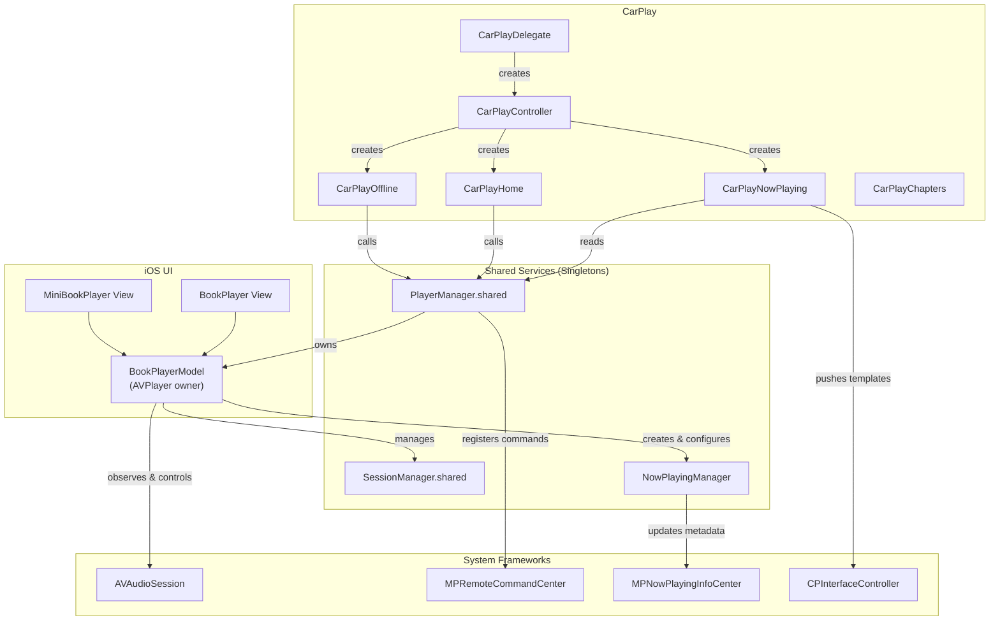
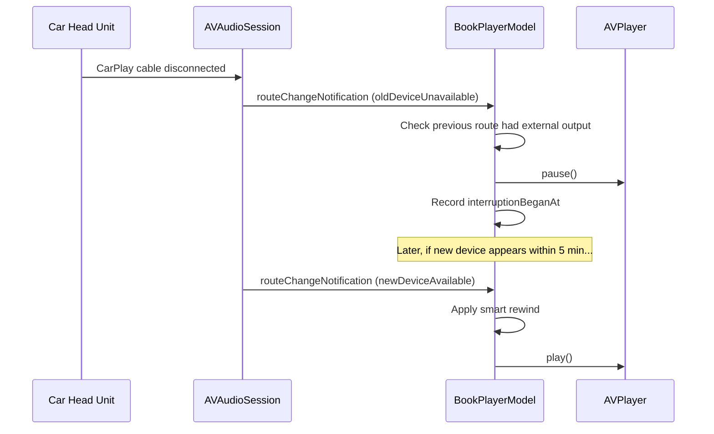

# CarPlay Audio Handling — Analysis & Fixes

## Problem Statement

AudioBooth does not behave correctly when used via Apple CarPlay. Reported
symptoms include playback continuing after muting the car's audio system and
other missing interactions that the iOS in-app player handles properly.

This document summarises the analysis of the player architecture, the
discrepancies found between the iOS UI player and the CarPlay integration,
and the changes made to address them.

---

## Architecture Overview

AudioBooth uses a **shared player model** — the same `AVPlayer` instance
powers both the on-device UI and the CarPlay head unit. The architecture
looks like this:

### Key Insight

Because `BookPlayerModel` is the single owner of the `AVPlayer`, **all audio
session observations must live there**. The CarPlay UI layer
(`CarPlayNowPlaying`, `CarPlayHome`, etc.) only interacts with playback
through `PlayerManager.shared` — it never touches `AVPlayer` directly.

This means that fixing "CarPlay audio issues" is largely about ensuring
`BookPlayerModel` responds to **all system audio events**, not just the ones
that commonly occur on the phone.

---

## Discrepancies Found

| # | Issue | iOS Player | CarPlay | Severity |
|---|-------|-----------|---------|----------|
| 1 | **Pause on audio route loss** (CarPlay disconnect, headphone removal, Bluetooth loss) | ❌ Was not handled | ❌ Was not handled | **High** — audio unexpectedly switches to speaker |
| 2 | **Pause for secondary audio** (navigation prompts, Siri) | ❌ Was not handled | ❌ Was not handled | **High** — user misses navigation cues |

> **Note:** Issues 1 and 2 affected _both_ iOS and CarPlay because the fix
> lives in `BookPlayerModel`, which is the shared player model. The fix
> therefore benefits both platforms.
| 3 | **Offline book auto-play** | N/A | ❌ Missing `play()` call | **Medium** — user sees now-playing but must manually press play |
| 4 | **CPNowPlayingTemplateObserver** | N/A | ❌ Not implemented | **Medium** — "Up Next" button does nothing |
| 5 | **Sleep timer in CarPlay** | ✅ Full sheet UI | ❌ No button | **Medium** — no way to set sleep timer while driving |
| 6 | **Audio session activation on CarPlay connect** | ✅ On player init | ❌ Not configured | **Low** — may cause delayed playback start |

### What Was Already Working

- ✅ **Pause command** — `MPRemoteCommandCenter.pauseCommand` is registered
  and correctly calls `onPauseTapped()`. If the car sends a pause command
  when muting, playback pauses.
- ✅ **Volume-to-zero detection** — `BookPlayerModel` observes
  `AVAudioSession.outputVolume` via KVO and pauses when it drops to 0. This
  works when the car's mute maps to a software volume change.
- ✅ **Audio interruption handling** — Phone calls and other interruptions
  are handled with smart rewind on resume.
- ✅ **Media services reset** — Reconfigures the audio session and resumes
  if playback was active.
- ✅ **Remote command center** — Play, pause, skip, seek, chapter navigation,
  and playback rate changes all work via `PlayerManager`.

---

## Changes Made

### 1. Audio Route Change Handling

**File:** `BookPlayerModel.swift` — `setupPlayerObservers()`

**What:** Added an observer for `AVAudioSession.routeChangeNotification`.

**Why:** When the audio output device disappears (CarPlay cable unplugged,
Bluetooth headphones disconnected, wired headphones removed), iOS
automatically routes audio to the built-in speaker. Without explicit
handling, the audiobook continues playing through the speaker — surprising
the user.

**How it works:**

The handler checks `oldDeviceUnavailable` and inspects the previous route's
outputs for external port types (`.carAudio`, `.bluetoothA2DP`,
`.bluetoothHFP`, `.bluetoothLE`, `.headphones`, `.airPlay`). If the lost
output was external and playback was active, it pauses.

When a new device appears (`newDeviceAvailable`) and the pause was recent
(< 5 minutes), it auto-resumes with a smart rewind — consistent with how
the existing interruption handler behaves.

### 2. Secondary Audio Silence Hint

**File:** `BookPlayerModel.swift` — `setupPlayerObservers()`

**What:** Added an observer for
`AVAudioSession.silenceSecondaryAudioHintNotification`.

**Why:** When the car's navigation system plays a turn-by-turn voice prompt,
iOS posts this notification to ask secondary audio sources to duck or pause.
AudioBooth uses the `.spokenAudio` mode (which is correct), but without
explicitly responding to this hint, the audiobook and navigation voice
overlap — the user can't hear either clearly.

**How it works:**
- On `.begin` → pause playback, record the time.
- On `.end` → if paused recently (< 5 min), apply smart rewind and resume.

### 3. CarPlay Offline Auto-Play

**File:** `CarPlayOffline.swift` — `onBookSelected()`

**What:** Added the missing `PlayerManager.shared.play()` call.

**Why:** `CarPlayHome` and `CarPlayLibrary` both call `play()` after setting
the current book, but `CarPlayOffline` was missing this call. The result was
that selecting an offline book in CarPlay showed the now-playing screen but
didn't start playback — the user had to press play manually.

### 4. CPNowPlayingTemplateObserver

**File:** `CarPlayNowPlaying.swift`

**What:** Registered `self` as an observer on `CPNowPlayingTemplate.shared`
and implemented the `CPNowPlayingTemplateObserver` protocol.

**Why:** Without an observer, tapping the "Up Next" button on the CarPlay
now-playing screen does nothing. With the observer, it now opens the chapter
list — the closest analogue to a "queue" in an audiobook app.

### 5. Sleep Timer Button

**File:** `CarPlayNowPlaying.swift` — `updateButtons()`

**What:** Added a moon (🌙) icon button that toggles the sleep timer.

**Why:** The iOS player has a full sleep-timer sheet, but CarPlay had no way
to set a timer. For drivers listening to audiobooks at night, this is an
essential feature. The button uses a simple toggle: tap to start a 15-minute
preset, tap again to cancel. This is deliberately simple for the limited
CarPlay interaction model.

### 6. Audio Session Activation on CarPlay Connect

**File:** `CarPlayDelegate.swift` — `didConnect`

**What:** Added explicit `AVAudioSession` configuration and activation when
CarPlay connects.

**Why:** `BookPlayerModel` configures the audio session when a book starts
playing, but if CarPlay connects while no book is loaded, the session isn't
configured for long-form audio. This can cause the system to treat the app
as a non-audio app, leading to unexpected behaviour when playback starts
later.

---

## Testing Guidance

These changes cannot be unit-tested in isolation because they depend on
`AVAudioSession` hardware notifications. To verify:

| Test Case | Steps | Expected |
|-----------|-------|----------|
| Route loss pause | Play audiobook → disconnect CarPlay/headphones | Playback pauses |
| Route reconnect resume | After route loss → reconnect within 5 min | Playback resumes with smart rewind |
| Nav prompt pause | Play audiobook → trigger car navigation prompt | Playback pauses during prompt, resumes after |
| Offline auto-play | CarPlay → Offline tab → tap a book | Book starts playing automatically |
| Sleep timer CarPlay | CarPlay → Now Playing → tap moon button | Timer starts (15 min); tap again to cancel |
| Up Next button | CarPlay → Now Playing → tap Up Next | Chapter list appears |
| CarPlay connect | Connect CarPlay with no active playback | No crash; audio session configured |

---

## Files Changed

| File | Change Type | Description |
|------|------------|-------------|
| `AudioBooth/Screens/BookPlayer/BookPlayerModel.swift` | Modified | Added route change + secondary audio observers |
| `AudioBooth/CarPlay/CarPlayNowPlaying.swift` | Modified | Added CPNowPlayingTemplateObserver, sleep timer button |
| `AudioBooth/CarPlay/CarPlayOffline.swift` | Modified | Added missing `play()` call |
| `AudioBooth/CarPlay/CarPlayDelegate.swift` | Modified | Added audio session activation on connect |
| `docs/CARPLAY_ANALYSIS.md` | New | This document |
